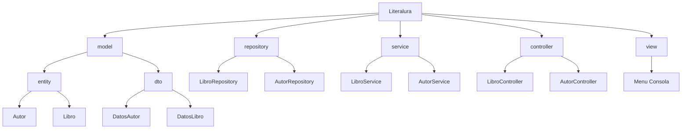

# Literalura

**Literalura** es una aplicación Java desarrollada con Spring Boot que permite explorar y registrar libros de la API de [Gutendex](https://gutendex.com/). Se pueden buscar libros por título, listar autores y libros registrados dentro de la base de datos, y realizar filtros por idioma o por autores vivos en un año específico.

Este proyecto corresponde al challenge **Practicando Spring Boot: Challenge Literalura** del programa **Oracle Next Education**.

---

## Funcionalidades

- Buscar libros por título usando la API de Gutendex.
- Listar libros registrados en la base de datos.
- Listar autores registrados.
- Filtrar autores vivos en un año determinado.
- Filtrar libros por idioma.
- Guardar libros y autores en base de datos evitando duplicados.

---

## Tecnologías utilizadas

- **Java 17**
- **Spring Boot 3**
- **Hibernate / JPA**
- **PostgreSQL**
- **Flyway (migraciones de base de datos)**
- **Lombok**
- **Jackson (para manejo de JSON)**

---

## Estructura del Proyecto (MVC)



## Base de Datos

La estructura de la base de datos está definida con Flyway. Contiene las siguientes tablas:

- **autores**: contiene información sobre los autores (nombre, fechas).
- **libros**: contiene información sobre los libros (título, idioma, descargas) y referencia al autor.

## Ejecucion del proyecto

1. Clona el repositorio:

``` bash
git clone https://github.com/tu-usuario/literalura.git
cd literalura
```
2. Asegúrate de tener PostgreSQL configurado y una base de datos creada.

3. Configura el archivo application.properties:

```properties
spring.datasource.url=jdbc:postgresql://localhost:5432/literalura_db
spring.datasource.username=tu_usuario
spring.datasource.password=tu_contraseña
spring.jpa.hibernate.ddl-auto=validate
spring.jpa.show-sql=true
```
4. Ejecuta la aplicación:

```bash
./mvnw spring-boot:run
```

## Autor

**Desarrollado por Luis Correa**